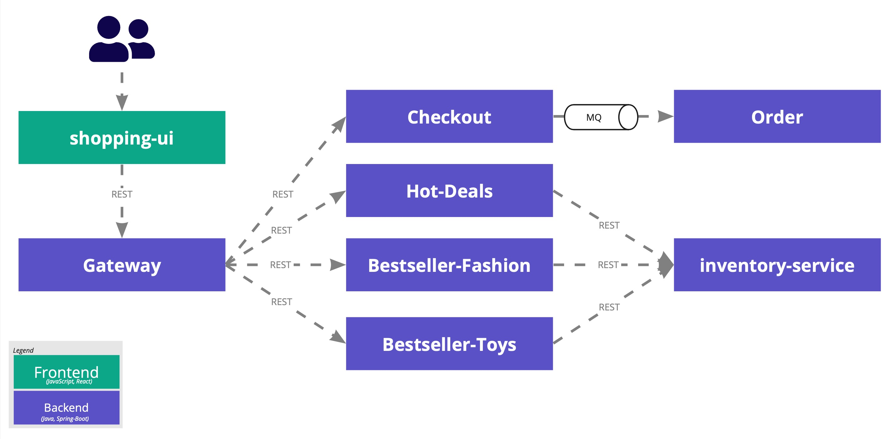

# steadybit Demo Application

## 📝 Introduction

We provide a small demo application to give you a quick and easy start into the world of Chaos Engineering.
This demo application is a product catalog consisting of products from three different categories (toys, fashion and hot-deals).

## High Level Architecture


The shopping demo consists of three backend services per each product category (`bestseller-fashion`, `bestseller-toys` and `hot-deals`).
Each microservice provides a list of products.
These products are aggregated by the `gateway`-microservice and exposed to the user via `shopping-ui`.
In addition, each product microservice uses the `inventory-service` to determine stock availability.

## Technical Architecture

All services are based on Spring Boot and use different Spring projects.

- [Spring Boot](https://spring.io/projects/spring-boot)
- [Spring Cloud](https://spring.io/projects/spring-cloud)
- [Spring Cloud Gateway](https://spring.io/projects/spring-cloud-gateway)
- [Spring Cloud Netflix](https://spring.io/projects/spring-cloud-netflix)
- [Spring Cloud Circuit Breaker](https://spring.io/projects/spring-cloud-circuitbreaker)
- [Spring Cloud Kubernetes](https://spring.io/projects/spring-cloud-kubernetes)


As mentioned above the `gateway` is the entrypoint for the UI.

### Products REST Endpoint
The `gateway` provides available products via the `/products`-endpoint which collects all products from each microservices (`bestseller-fashion`, `bestseller-toys` and `hot-deals`).
This endpoints is implemented in the [ProductsController](blob/master/gateway/src/main/java/com/steadybit/demo/shopping/gateway/ProductsController.java).
Multiple implementation strategies exists using each different resilience patterns: fallbacks, timeouts and circuit breakers as described subsequently.

#### Basic Implementation
This is the most simplest implementation using neither fallbacks nor timeouts.

```java

@RestController
public class ProductsController {
    @Value("${rest.endpoint.hotdeals}")
    private String urlHotDeals;

    private RestTemplate restTemplate;
    //...

    @RequestMapping(value = { "/products" }, method = RequestMethod.GET)
    public Products getProducts() {
        Products products = new Products();
        //...
        products.setHotDeals(getProduct(urlHotDeals));
        return products;
    }

    private List<Product> getProduct(String url) {
        return restTemplate.exchange(url, HttpMethod.GET, null, productListTypeReference).getBody();
    }
}
```
#### Circuit Breaker with Fallback

Besides the basic implementation described above, there is also a REST Endpoint using an implemented Circuit Breaker.
In order to reach that version of the endpoint, the `gateway`'s [ProductsController](blob/master/gateway/src/main/java/com/steadybit/demo/shopping/gateway/ProductsController.java) is called via `/products/circuitbreaker`.
Whenever the corresponding product-microservice (e.g. `hot-deals`) is not reachable the `/products/fallback` will provide an empty list as an alternative response.
This way, the UI is simply not showing products from this category but can still show results of the other microservices (e.g `fashion`, `toys`).

```java

@RestController
@RequestMapping("/products")
public class ProductsController {
    // ...
    @GetMapping("/circuitbreaker")
    public Mono<Products> getProductsCircuitBreaker() {
        Mono<List<Product>> hotdeals = getProductCircuitBreaker("/products/hotdeals/circuitbreaker");
        //...
        return Mono.zip(hotdeals, fashion, toys)
                .flatMap(transformer -> Mono.just(new Products(transformer.getT1(), transformer.getT2(), transformer.getT3())));
    }

    @GetMapping("/fallback")
    public ResponseEntity<List<Product>> getProductsFallback() {
        return ResponseEntity.ok().headers(new HttpHeaders()).body(Collections.emptyList());
    }

    private Mono<List<Product>> getProductCircuitBreaker(String uri) {
        return webClient.get().uri(uri)
                .exchange()
                .flatMap(response -> response.bodyToFlux(productTypeReference)
                        .collectList()
                        .flatMap(Mono::just))
                .doOnError(throwable -> log.error("Error occured", throwable));
    }
}
```

The routing of the Circuit Breaker is implemented in the `gateway`'s Main Class: [GatewayApplication](blob/master/gateway/src/main/java/com/steadybit/demo/shopping/gateway/GatewayApplication.java).

````java

@SpringBootApplication
@EnableDiscoveryClient
public class GatewayApplication implements WebFluxConfigurer {
    //...
    @Bean
    public RouteLocator routes(RouteLocatorBuilder builder) {
        return builder.routes()
                // ...
                .route("cb-hotdeals", p -> p.path("/products/hotdeals/circuitbreaker**")//
                        .filters(f -> f.retry(c -> c.setRetries(2).setSeries(HttpStatus.Series.SERVER_ERROR))//
                                .hystrix(c -> c.setName("hotdeals").setFallbackUri("forward:/products/fallback"))
                                .setPath("/products"))//
                        .uri(urlHotDeals))//
                .build();
    }

}
````

### Additional REST Endpoints

There are some additional endpoints which are helpful for HTTP Health checks during experiments, such as:

- `/product/hotdeals` to reach `hot-deals` products-list and check it's availability
- `/product/fashion` to reach `fashion` products-list and check it's availability
- `/product/toys` to reach `toys` products-list and check it's availability

## Deploying the Application

Our demo can be run on different Docker based platforms using the deployment scripts provided.
Checkout the [Steadybit Quickstart](https://docs.steadybit.com/quick-start/deploy-example-application) for more details.
