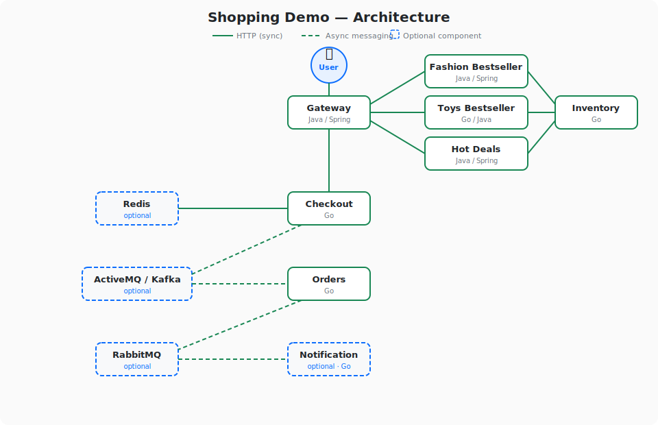

# Steadybit Shopping Demo

## Introduction

A microservices demo application for exploring Chaos Engineering with [Steadybit](https://steadybit.com).
The app is a product catalog with checkout, order processing, and notifications — built to showcase resilience patterns and failure modes.

## Architecture

The live architecture overview with real-time health status is available in the UI at `/#/overview`.



### Core Services

| Service | Tech | Description |
|---------|------|-------------|
| **Gateway** | Java / Spring Boot | API gateway — proxies all requests, aggregates products, health checks |
| **Fashion Bestseller** | Java / Spring Boot | Product catalog for fashion items |
| **Toys Bestseller** | Go or Java | Product catalog for toys |
| **Hot Deals** | Java / Spring Boot | Product catalog for hot deals |
| **Inventory** | Go | Stock availability service used by all product services |
| **Checkout** | Go | Cart management (Redis) and order submission (Kafka or ActiveMQ) |
| **Orders** | Go | Consumes orders from Kafka, publishes events to RabbitMQ |
| **Notification** | Go | Subscribes to order events from RabbitMQ |

### Infrastructure (all opt-in via Helm values)

| Component | Default | Purpose |
|-----------|---------|---------|
| **Redis** | disabled | Cart caching for checkout (`cart:{id}` keys, 24h TTL) |
| **Kafka** | disabled | Async messaging between checkout and orders |
| **ActiveMQ** | disabled | Alternative to Kafka for checkout → orders messaging |
| **RabbitMQ** | disabled | Event bus between orders and notification |

### Request Flow

```
User → Gateway → Fashion / Toys / Hot Deals → Inventory
                → Checkout → Redis (cart cache)
                           → Kafka/ActiveMQ → Orders → RabbitMQ → Notification
```

## API Endpoints

### Products

The gateway exposes products via `/products` with multiple resilience strategies:

| Endpoint | Timeout | Fallback | Retry | Circuit Breaker | Behavior on failure |
|----------|:-------:|:--------:|:-----:|:---------------:|---------------------|
| `/products` | No | No | No | No | HTTP 500 or infinite delay |
| `/products/exception` | No | Yes (catch) | No | No | Category omitted on error, infinite delay on slow response |
| `/products/timeout` | Yes | Yes (catch) | No | No | Category omitted on error or slow response |
| `/products/retry` | Yes | Yes (resilience4j) | Yes | No | Like timeout, with 3 retries at 500ms intervals |
| `/products/circuitbreaker` | Yes | Yes (resilience4j) | Yes | Yes | Like retry, with circuit breaker to prevent overload |
| `/products/parallel` | 30s default | No | No | No | Parallel fetch, same failure modes as basic |

### Checkout

| Method | Endpoint | Description |
|--------|----------|-------------|
| `POST` | `/checkout/direct` | Synchronous checkout — publishes order to Kafka/ActiveMQ immediately |
| `POST` | `/checkout/buffered` | Async checkout — saves cart to Redis, background worker publishes to Kafka |
| `GET` | `/checkout/cart/{id}` | Retrieve a cart from Redis cache |

### Health

| Endpoint | Description |
|----------|-------------|
| `GET /api/health/dependencies` | Aggregated health of all deployed services (parallel checks, 500ms timeout) |

The health endpoint dynamically includes only deployed components — services behind disabled Helm values are excluded.

## Deploying the Application

### Installation via Helm

```sh
helm repo add steadybit-shopping-demo https://steadybit.github.io/shopping-demo
helm repo update
helm upgrade steadybit-shopping-demo \
    --install \
    --wait \
    --timeout 5m0s \
    --set gateway.service.type=ClusterIP \
    steadybit-shopping-demo/steadybit-shopping-demo
```

### Enabling Optional Components

```yaml
# values.yaml
redis:
  enabled: true

kafka:
  enabled: true

rabbitmq:
  enabled: true

notification:
  enabled: true  # requires rabbitmq.enabled=true
```

## Testing the Full Chain

Once deployed with Redis, Kafka, RabbitMQ, and Notification enabled, you can test the entire flow:

```sh
# 1. Fetch products through the gateway
curl https://<your-host>/products

# 2. Add an item to the cart (saved in Redis)
curl -X POST https://<your-host>/checkout/buffered \
  -H 'Content-Type: application/json' \
  -d '{"id": "demo-cart", "items": [{"productId": "1", "quantity": 2, "price": 9.99}]}'

# 3. Retrieve the cart from Redis
curl https://<your-host>/checkout/cart/demo-cart

# 4. Submit an order directly (bypasses Redis, publishes to Kafka/ActiveMQ immediately)
curl -X POST https://<your-host>/checkout/direct \
  -H 'Content-Type: application/json' \
  -d '{"id": "order-1", "items": [{"productId": "1", "quantity": 1, "price": 9.99}]}'

# 5. Check the health of all dependencies
curl https://<your-host>/api/health/dependencies
```

The buffered flow: checkout saves to Redis → background worker publishes to Kafka → orders consumes and publishes to RabbitMQ → notification consumes the event.

## CI/CD Integration

### Experiments

Run experiments continuously to validate resilience. For a GitOps approach, version your experiments and run them on pull requests.

- [GitHub Action definition](https://github.com/steadybit/shopping-demo/blob/develop/.github/workflows/run-experiments.yml)
- [Latest runs](https://github.com/steadybit/shopping-demo/actions/workflows/run-experiments.yml)
- [Blog post: GitOps + Chaos Engineering](https://steadybit.com/blog/boost-your-gitops-practices-by-integrating-chaos-engineering-with-steadybit)

[](https://platform.steadybit.com/experiments/GITHUB/edit/GITHUB-17?tenant=demo)

### Advice

Validate advice status for targets from your CI/CD pipeline using the Steadybit CLI.

- [GitHub Action definition](https://github.com/steadybit/shopping-demo/blob/develop/.github/workflows/advice.yml)
- [Latest runs](https://github.com/steadybit/shopping-demo/actions/workflows/advice.yml)
